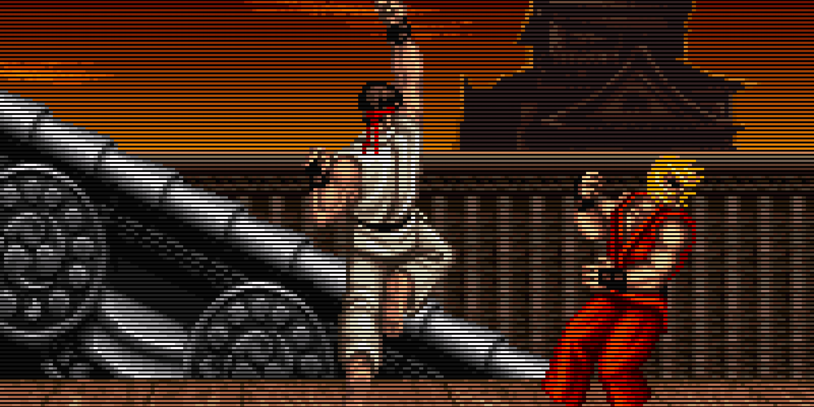
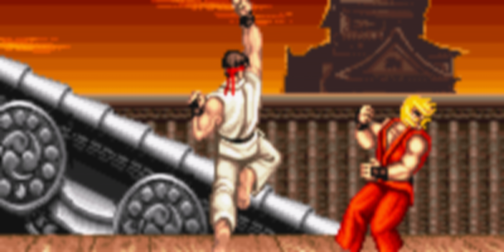
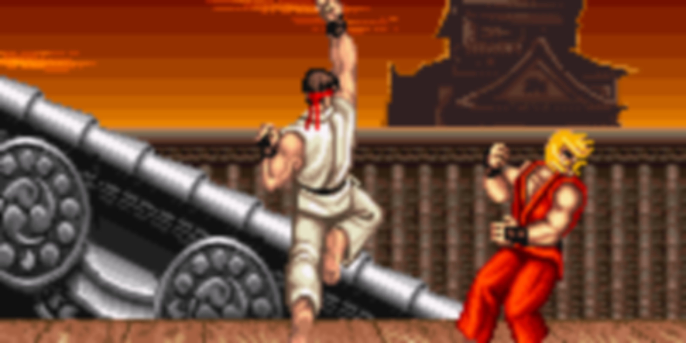

# Image Upscaler Using CRT Filters

This is an unfinished project that tests the upscaling of pixel sprite images with the help of custom CRT filters as an intermediate step, as seen in retro games which were designed with CRT displays in mind. The idea behind it is that CRT filters might unveil details that aren't visible from the basic pixel art, and a targetted cleanup and upscale from the CRT filtered image could perhaps retain some of this detail. There are many ways to approach this problem and the code (in a rather messy way) includes 3 different custom methods for the cleaning up of the CRT-filtered image. This project uses Python and OpenCV to filter, clean, and upscale a given input image (must be pixel sprite).

The final results are admitedly not much better than a regular gussian blur but it was still a fun experiment to try.

# Screenshots from method 1

## Original

## Added scanlines

## CRT Filter

## Cleanup between scanline areas

## Sharpened

## Basic guassian blur for comparison
